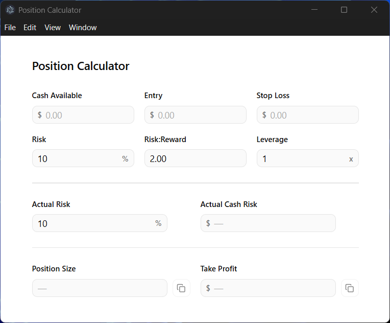

# Position Calculator

A small, fast Electron desktop app for sizing trades. Enter your account and
trade parameters and it computes how large a position to take, where to set your
take-profit, and what you're actually risking once leverage is applied — with
inline validation and one-click copy of the results.

<p align="center">
  
</p>

> **Disclaimer:** This is a personal utility for calculating position sizes. It
> is not financial advice and comes with no warranty. Always verify the numbers
> against your broker before placing an order.

## Features

- **Position sizing** from your available cash, risk tolerance, and stop distance.
- **Take-profit price** derived from your entry, stop loss, and desired
  risk:reward ratio.
- **Leverage-aware risk read-outs** — see your effective risk both as a
  percentage and as a cash amount once leverage is factored in.
- **Inline validation** that only fires once the relevant fields are filled, so
  you don't see transient errors while typing.
- **One-click copy** of the position size and take-profit price, with visual
  confirmation.
- **Debounced, synchronized recompute** — every result and validation message
  comes from a single snapshot recalculated 300 ms after your last keystroke, so
  the UI never flashes inconsistent state.

## Inputs

| Input            | Notes                                                        |
| ---------------- | ------------------------------------------------------------ |
| Cash Available   | Your account balance to size against. Must be greater than 0. |
| Entry            | Planned entry price. Must be greater than the stop loss.     |
| Stop Loss        | Price at which the trade is invalidated.                     |
| Risk (%)         | Percentage of cash you're willing to risk on the trade.      |
| Risk:Reward      | Target reward-to-risk ratio. Must be greater than 0.         |
| Leverage         | Multiplier applied to the position (1 = no leverage).        |

## Outputs

**Primary** (copyable):

- **Position Size** — the number of units to buy:

  ```
  positionSize = floor( (cash × leverage × (risk% / 100)) / (entry − stopLoss) )
  ```

- **Take Profit** — the target exit price:

  ```
  takeProfit = entry + (entry − stopLoss) × riskReward
  ```

**Secondary** (informational): effective risk once leverage is applied —

```
actualRisk%    = leverage × risk%
actualCashRisk = leverage × cash × (risk% / 100)
```

## Tech stack

- [Electron](https://www.electronjs.org/) 42 + [Electron Forge](https://www.electronforge.io/) (Webpack)
- [React](https://react.dev/) 19
- [Tailwind CSS](https://tailwindcss.com/) v4 with [shadcn](https://ui.shadcn.com/) / [Base UI](https://base-ui.com/) components
- [lucide-react](https://lucide.dev/) icons

## Getting started

Requires [Node.js](https://nodejs.org/) (with npm).

```sh
git clone https://github.com/jasel-lewis/com.jasel.trading.position-calculator.git
cd com.jasel.trading.position-calculator
npm install
npm start
```

`npm start` launches the app in development with hot-reloading.

## Building

```sh
npm run package   # bundle the app into a runnable executable (no installer)
npm run make      # produce distributables for the current platform
```

Makers are configured for Windows (Squirrel), macOS (ZIP), and Linux (`.deb`,
`.rpm`). Run `npm run make` on each target platform to produce its installers.

### Publishing

Releases are published to GitHub via `@electron-forge/publisher-github`:

```sh
npm run publish
```

This requires a `GITHUB_TOKEN` with repo access in the environment (the
`publish` script loads it via `env-cmd`).

## License

[MIT](LICENSE) © Jasel
